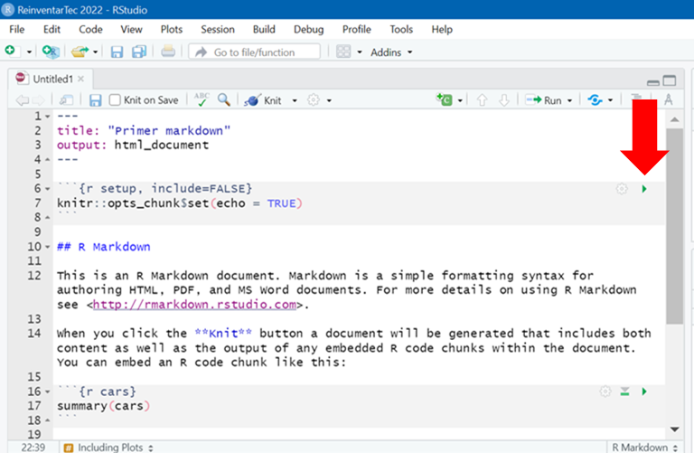

<style type="text/css">
  body{
  font-size: 14pt;
}
  code.r{
  font-size: 12pt;
}
</style>

<br>

### ¡Hola!

<br>

Les presentamos un documento RMarkdown renderizado a HTML :) 

<br>


En este ejemplo vamos a ver cómo construir un archivo Rmarkdown que incluya texto, tablas y figuras en el documento.

<br>

El documento se divide en **3 partes**:

* Sintáxis
* Bloques de código
* Pasos para analizar datos en Rmarkdown

***

<h1 style="background-color:#ffbbbb">Sintaxis</h1>

<br>

## Los títulos se identifican anteponiendo numerales (#)

<br>

### Con cada # que que se agrega pasamos a otro nivel de subtítulo  

<br>

En el texto se pueden señalar palabras en:

* **negrita** 
* *itálica* 
* ***itálica y negrita***
* ~~tachado~~
* <mark style="background-color:#FFFF00">resaltado</mark> 
* <p style="color:red">color</p>

<br>

<p class="text-center" style="background-color:#aabbff">También se pueden cambiar el color del fondo y la alineación del texto o incluso agregar emojis `r knitr::asis_output("\U1F609")`</p>

<br>

Podemos incluir `codigos` y links como éste al [capítulo sobre Rmarkdown del libro *R para Ciencia de Datos* en español](https://es.r4ds.hadley.nz/r-markdown.html). 

<br>

Y muchas más opciones!

***

<h1 style="background-color:#ffbbbb">Bloques o 'Chunks' de código</h1>

<br>

Los bloques o 'chunks' son fragmentos de código incluidos en nuestro documento. Cada bloque comienza con ` ```{r} ` y termina con` ``` `. 
<br>
<br>

Se agregan:

* apretando Ctrl+Alt+I

* haciendo click en *Code* > *Insert Chunk*

<br>

Dentro de ellos podemos escribir texto anteponiendo un #. Todo lo que este detrás del # **no** será leido.

<br>

Los códigos de bloque se pueden correr:

* apretando Ctrl+Enter en la línea de código 

* haciendo click sobre la flecha verde en cada bloque 

<center>
{width="70%" height="70%"}
</center>

<br>

## Dentro de los bloques podemos:

<span style="color:purple; font-size:18pt">1. Indicar que se incluya una imagen</span>

```{r imagen, out.width = '50%', out.height= '50%', fig.align = 'center'}

# comando para incluir una imagen

```

<br>

<span style="color:purple; font-size:18pt">2. Realizar operaciones matemáticas</span>

```{r operacion}
# ejemplo de operación matemática
2 + 2
```

<br>

<span style="color:purple; font-size:18pt">3. Configurar condiciones para futuros bloques</span>

```{r setup}

# para cambiar algunas opciones por default de los bloques 
knitr::opts_chunk$set(
  
          warning = FALSE, #evita que se muestren "warnings"
          message = FALSE, #evita que se muestren mensajes
          fig.align = 'center' #centra las imágenes
  
              )
```

<br>

<span style="color:purple; font-size:18pt">4. Realizar análisis de datos!</span>

Analizaremos el set de datos llamado *"Datos 2010-2016.csv"* (que pueden descargar de [este link](<https://github.com/chicasentec/masdatos/blob/master/datasets/Datos%202010-2016.csv>)) pero ahora con R en vez de Python.

<br>

***

<h4 align="center">Para ver el documento final que incluye tanto el contenido como la salida de cualquier bloque de código de R debemos hacer clic en el botón *Knit* y listo!</h4>

***

<br>

<h1 style="background-color:#ffbbbb">Pasos para analizar datos en Rmarkdown</h1>

<br>

<span style="color:purple; font-size:18pt">Paso 1: cargar los paquetes necesarios</span>

Para cargar, manipular y vizualizar los datos debemos tener instalados ciertos **paquetes** y cargarlos. 

La instalación se realiza una única vez y los paquetes se cargan cada vez que se inicia una sesión de R. 

En este caso utilizaremos 2 paquetes:

1. `tidyverse` (incluye varios paquetes diseñados para la ciencia de datos) 
2. `janitor`

<br>

Carguemos los paquetes: 

```{r paquete}

# Instalación de los paquetes (solo la primera vez)
# Si nunca los instalaron, sacar el # que esta adelante de los siguientes comandos

# install.packages("tidyverse")
# install.packages("janitor")

# Carga de los paquetes
library(tidyverse)
library(janitor)
```

<br>

<span style="color:purple; font-size:18pt">Paso 2: cargar la base de datos</span>

Se pueden leer bases de datos en formato `csv` utilizando la función `read.csv()` y generando un objeto que los contenga.

```{r datos}

#Creación de un objeto con los datos
datos <- read.csv(file="Datos 2010-2016.csv",
                  header=T)
```

<br>

Podemos ver la estructura de los datos utilizando la función `glimpse()`.

```{r glimpse}

# Para ver cuáles son las variables y de qué tipo son
glimpse(datos)

```

<br>

El set de datos tiene **58840 filas** (observaciones) y **22 columnas** (variables).

Debajo estan los nombres de las variables (detras de cada $), el tipo de variable (numérica o de caracteres) y algunos de los valores que toman.

<br>

En este ejemplo vamos a analizar la <mark style="background-color:#aabbff">**relación de ingresantes que se autoperciben mujeres o varones en las 10 carreras de postgrado con mayor número de ingresantes**</mark> por lo que antes de realizar cualquier análisis hay que "limpiar" los datos.

<br>

<span style="color:purple; font-size:18pt">Paso 3: limpieza de datos</span>

<p align="center">**Este paso suele ser uno de los más tediosos pero también de los más importantes!**</p>

<br>

Pero no se preocupen, R lo hace rápido y para este taller ya traemos la solución `r knitr::asis_output("\U1F609")` 

<br>

Estos son los pasos para obetener la tabla de datos "limpia" de las 10 carreras de postgrado con mayor número de ingresantes para los análisis.


```{r limpieza}

# Generaremos un nuevo objeto con los datos de interés 
# a partir del set original de datos

datos_limpios <- datos %>% 
  
  # renombramos las columnas sin mayúsculas y con "_" entre palabras
  clean_names() %>% 

  # seleccionamos las variables de interés
  select(nivel_de_la_oferta,
         carrera,
         total_de_nuevos_inscriptos,
         nuevos_inscriptos_varones,
         nuevos_inscriptos_mujeres) %>% 
  
  # convertimos a factor el nivel y la carrera
  mutate(across(c(nivel_de_la_oferta,
                  carrera), 
                as.factor)) %>% 
  
  # convertimos a números los inscriptos
  mutate(across(c(total_de_nuevos_inscriptos,
                  nuevos_inscriptos_varones,
                  nuevos_inscriptos_mujeres), 
                as.numeric)) %>% 
  
  # reemplazamos los valores faltantes (NA) por 0
  mutate_if(is.numeric, ~replace_na(., 0)) %>%  
  
  # filtramos las carreras de posgrado
  filter(nivel_de_la_oferta=="Posgrado") %>% 
  
  # eliminamos la columna de "nivel_de_la_oferta"
  select(-nivel_de_la_oferta)%>% 
  
  # agrupamos los datos por carrera
  group_by(carrera)%>% 
  
  # sumamos los valores por carrera
  summarise(across(everything(), sum))%>% 

  # seleccionamos las 10 carreras con más personas inscriptas
  top_n(10,total_de_nuevos_inscriptos) %>% 
  
  # renombramos las variables
  rename("Carrera" = carrera, 
         "Total" = total_de_nuevos_inscriptos, 
         "Varones" = nuevos_inscriptos_varones,
         "Mujeres" = nuevos_inscriptos_mujeres)

```

<br>

<h2 style="color:purple">Ahora sí pasemos a algo más divertido `r knitr::asis_output("\U1F601")`</h2>

<br>

<span style="color:purple; font-size:18pt">Paso 4: analizar los datos</span>

<br>

Podemos simplemente **visualizar los datos**

<br>

#### *En una tabla*

<br>

```{r tabla, echo=TRUE, eval=FALSE}

datos_limpios %>%
  kableExtra::kbl(caption = "Tabla 1. Número  de ingresantes totales y que se autoperciben mujeres o varones en las 10 carreras de postgrado con mayor número  de ingresantes.") %>%
  kableExtra::kable_classic(full_width = F, html_font = "Helvetica", font_size = 12)
```

<br>

```{r tabla_res, echo=FALSE}

datos_limpios %>%
  kableExtra::kbl(caption = "Tabla 1. Número  de ingresantes totales y que se autoperciben mujeres o varones en las 10 carreras de postgrado con mayor número  de ingresantes.") %>%
  kableExtra::kable_classic(full_width = F, html_font = "Helvetica", font_size = 12)
```

<br>

#### *Con un gráfico*

<br>

```{r grafico}

datos_limpios %>%
  pivot_longer(!c(Carrera, Total), names_to = "Género", values_to = "N") %>% 
    ggplot(aes(x =reorder(Carrera, N), y =N)) +
      geom_col(aes(fill=Género), stat = "identity")+ 
      scale_fill_viridis_d() +
      scale_x_discrete(labels = label_wrap_gen(width = 27))+
      coord_flip() + 
      labs(x = NULL, y = "Número de personas")+
      theme_minimal()+ 
      theme(legend.text = element_text(size = 12),
            legend.position = "bottom",
            axis.text = element_text(size = 12),
            title = element_text(size = 12, hjust = 0.5))

```

O también podemos **estimar (y visualizar) valores de interés**

```{r porcentaje}

  datos_limpios %>%
    pivot_longer(!c(Carrera, Total), 
                 names_to = "Género", values_to = "N") %>% 
  group_by(Género)%>% 
  summarise(total = sum(N)) %>% 
  mutate(porcentaje = total/sum(total),
         ymax = cumsum(porcentaje),
         ymin = c(0, head(ymax, n=-1)),
         labelPosition = (ymax + ymin) / 2,
         label = paste0(Género, "\n value: ", total)) %>% 
    ggplot(aes(x=2, y=porcentaje, fill=Género)) +
      geom_bar(stat = "identity") +
      xlim(0.5, 2.5) +
      coord_polar(start = 0, theta = "y") +
      labs(x = "", 
           y = "", 
           title = "Representación de género de las 10 carreras\nde postgrado con más ingresantes\nentre 2010 y 2016",
           fill= NULL) +
      scale_fill_viridis_d() +
      geom_text(aes(label = scales::percent(porcentaje)),
                size = 6, position = position_stack(vjust = 0.5),
                colour = c(rep("white", 1), 1))+
      theme_void() +
      theme(legend.text = element_text(size = 16),
            legend.position = "bottom",
            title = element_text(size = 16))
```

<br>

<h1 align="center">Esperamos que les haya gustado!</h1>

<br>

<h2 align="center">El material para este documento lo pueden encontrar en este [repositorio de GitHub](<https://github.com/RLadies-BA/Reinventartec-2022>)</h2>
